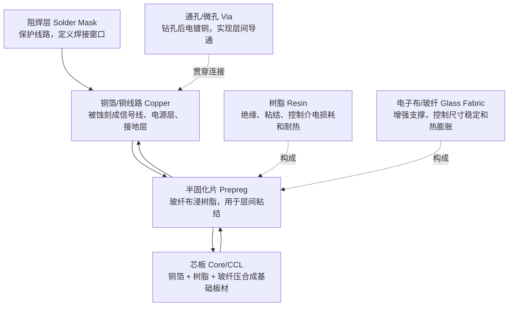
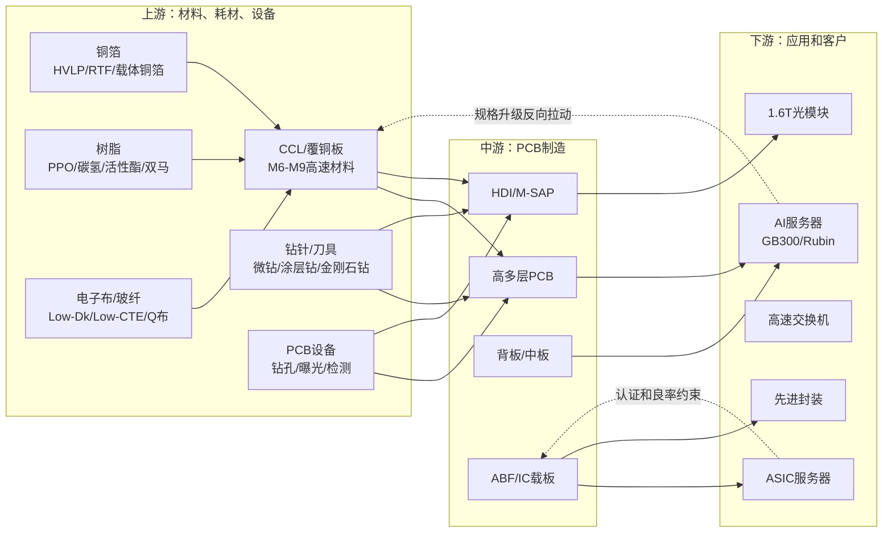

# PCB 结构与产业链拆解

本文档补充 PCB 行业研究的“第一性解释”：PCB 到底是什么结构，各材料在板子里起什么作用，AI 服务器升级为什么会沿产业链传导到 CCL、铜箔、电子布/玻纤、树脂、钻针和设备。

可直接查看的报告版：[PCB 拆解与产业链深度分析报告](./pcb_deep_analysis_report.html)。

说明：此前的 SVG 入口已停用，避免在 Codex 中点击后闪退；后续展示优先使用 HTML 报告或 PNG 截图。

## 1. PCB 是什么

PCB 是电子系统里的“结构化连接平台”。它不是一块简单的塑料板，而是由导电层、绝缘层、增强材料、树脂体系、孔连接和表面保护层共同构成。

一个多层 PCB 可以简单理解为：

```text
芯片/器件焊接在板上
  -> 铜箔蚀刻成线路，负责导电和信号传输
  -> 树脂和玻纤构成绝缘、支撑和稳定结构
  -> 钻孔和电镀形成层间连接
  -> 阻焊层保护线路并控制焊接区域
```

## 2. PCB 横截面示意



## 3. 核心材料作用

| 材料/环节 | 在 PCB 里的作用 | AI 高端 PCB 为什么更看重 | 关键指标 |
| --- | --- | --- | --- |
| 铜箔 | 导电层，蚀刻成信号线、电源层和接地层。 | 高速信号要求更低损耗、更低粗糙度、更稳定厚度。 | HVLP、RTF、载体铜箔、表面粗糙度、厚度一致性。 |
| 树脂 | 绝缘和粘结体系，包覆玻纤并决定介电、耐热、粘结性能。 | AI 服务器高速传输要求低 Dk/Df，高层数压合要求耐热、低 CTE。 | PPO、碳氢树脂、活性酯、双马/多马、Tg、Dk、Df、CTE。 |
| 电子布/玻纤 | 增强骨架，控制机械强度、尺寸稳定和热膨胀。 | 高多层板受热和压合更容易翘曲，高速信号要求低介电损耗。 | Low-Dk、Low-CTE、Q布/石英布、耐 CAF。 |
| CCL/覆铜板 | PCB 基础材料，由铜箔、树脂、玻纤布压合而成。 | PCB 升级首先传导到 CCL 等级，从普通 FR-4 到 M6/M7/M8/M9。 | 材料等级、交期、涨价、客户认证、良率。 |
| 钻针/钻孔设备 | 形成通孔、盲孔、微孔，后续电镀实现层间互连。 | 层数更高、孔径更小、材料更硬，会提高钻针消耗和设备精度要求。 | 微钻、高长径比钻、涂层钻、金刚石涂层钻、孔壁质量。 |
| 曝光/显影设备 | 将线路图形转移到板材上，决定精细线路加工能力。 | HDI、M-SAP、细线宽线距要求更高曝光精度和制程稳定。 | 对位精度、解析度、产能、良率。 |

## 4. 上游到下游产业链图谱



## 5. AI 升级如何传导

| 下游变化 | 中游变化 | 上游变化 | 投资研究要点 |
| --- | --- | --- | --- |
| GB300/Rubin 单柜复杂度提升 | PCB 层数、面积、厚度、压合次数增加 | CCL、铜箔、树脂、电子布用量和等级提升 | 不只看服务器出货量，更要看单柜 PCB 价值量。 |
| ASIC 客户放量 | ABF/IC载板、高端 PCB 需求增加 | ABF 材料、树脂、载板工艺要求提高 | A 股映射要看客户认证和利润归属。 |
| 1.6T 光模块升级 | SLP、M-SAP、HDI 小板价值量提升 | 精细线路、曝光、微钻和高端材料需求增加 | 关注 M-SAP 产能、良率和光模块出货。 |
| CCL 升级到 M8/M9 | 高速低损耗板材成为关键 | HVLP4 铜箔、Low-Dk 二代布、Q布、高频高速树脂受益 | 材料侧看交期、涨价、客户认证。 |
| Q布/M9 等高端材料导入 | 钻孔难度上升，孔壁质量要求提高 | 微钻、涂层钻、金刚石涂层钻和设备受益 | 设备耗材从“配套”变成工艺瓶颈。 |

## 6. 缺口公司补充

| 环节 | 公司 | 基本面线索 | 资料来源 |
| --- | --- | --- | --- |
| 高频高速树脂 | 圣泉集团 | 2025 年报显示，公司较早布局 PPO，已实现千吨级 PPO 树脂及百吨级碳氢树脂量产，并与头部 PCB/CCL 厂联合开发和批量供货。 | [圣泉集团2025年报](https://static.cninfo.com.cn/finalpage/2026-04-25/1225186878.PDF) |
| 高频高速树脂 | 东材科技 | 2025 年报/公告口径显示，公司高速电子树脂包括双马来酰亚胺、活性酯、碳氢树脂、聚苯醚等，受益 AI 和算力升级；2025 年营收 51.81 亿元，归母净利润 2.85 亿元。 | [中国证券报](https://www.cs.com.cn/ssgs/01/2026/04/23/detail_2026042310006221.html) |
| 高频高速树脂 | 同宇新材 | 与建滔、生益、南亚新材等 CCL 厂建立合作，电子树脂国产化线索明确。 | [2025年报转录](https://www.fxbaogao.com/detail/5365345) |
| 电子布/玻纤 | 宏和科技 | 年报称 AI 服务器、算力和高频高速通信推动 LowDK、LowCTE、Q布方向，高端特种电子布 2025 年被客户批量应用并扩产。 | [宏和科技2025年报](https://money.finance.sina.com.cn/corp/view/vCB_AllBulletinDetail.php?id=12071953&stockid=603256) |
| 电子布/玻纤 | 中国巨石 | 2025 年电子布销量 10.6 亿米，同比增加，需继续跟踪特种布进展。 | [年报点评](https://stock.finance.sina.com.cn/stock/go.php/vReport_Show/kind/search/rptid/827372651179/index.phtml) |
| 电子布/玻纤 | 中材科技/泰山玻纤 | 市场资料显示其覆盖低介电、低膨胀和 Q布方向，需回溯公司公告验证收入占比。 | [行业报道](https://www.sina.cn/news/detail/5301835046849718.html) |
| 钻针/耗材 | 鼎泰高科 | 2025 年半年度报告称公司产品覆盖钻针、铣刀、磨刷、自动化设备，微型钻针、涂层钻针、高长径比钻针占比提升。 | [鼎泰高科2025半年报](https://disc.static.szse.cn/disc/disk03/finalpage/2025-08-21/b468ec17-9e54-45bf-8a7c-519efdc35601.PDF) |

## 7. 核心公司基本面快照

| 公司 | 环节 | 基本面补充 | 后续跟踪 |
| --- | --- | --- | --- |
| 胜宏科技 | 高端 PCB | 2025 年营收 192.92 亿元，同比 79.77%；归母净利润 43.12 亿元，同比 273.52%；毛利率 35.22%，受益 AI PCB 高端产品放量。 | AI PCB 收入占比、M-SAP 良率、ASIC 客户、扩产进度。 |
| 沪电股份 | 高速 PCB | 2025 年数通 PCB 营收约 146.56 亿元，同比 45.21%；扩产聚焦 AI 服务器和高速通信板。 | 数通板毛利率、海外基地、AI服务器/HPC占比。 |
| 生益科技 | CCL/PCB | 2025 年营收 284.31 亿元，同比 39.45%；归母净利润 33.34 亿元，同比 91.75%；覆铜板和粘结片收入 177.74 亿元，PCB 收入 91.44 亿元。 | 高速 CCL 占比、泰国产能、生益电子利润贡献。 |
| 圣泉集团 | 高频高速树脂 | 已量产 PPO 和碳氢树脂并切入头部 PCB/CCL 客户，属于树脂环节核心补充公司。 | PPO/碳氢树脂收入、客户认证、扩产节奏。 |
| 东材科技 | 高频高速树脂 | 2025 年营收 51.81 亿元，归母净利润 2.85 亿元，高速电子树脂是增量方向。 | 2 万吨高速通信基板用电子材料项目、电子材料毛利率。 |
| 宏和科技 | 电子布 | 高端功能性特种电子布进入客户批量应用和扩产阶段。 | Low-Dk/Low-CTE/Q布收入、产能利用率。 |
| 鼎泰高科 | 钻针/耗材 | 高端 PCB 拉动微型钻针、涂层钻针、高长径比钻针占比提升。 | 钻针销量、ASP、金刚石涂层钻导入。 |

## 8. 下一步

1. 把上述公司按 `核心受益/弹性受益/映射受益/待验证` 重排进 `pcb_industry_research_v0.md`。
2. 为树脂、电子布、设备耗材各补一页更细的公司对比。
3. 如果需要独立图片文件，优先从 HTML 报告截图导出 PNG；不再使用 SVG 作为点击入口。
